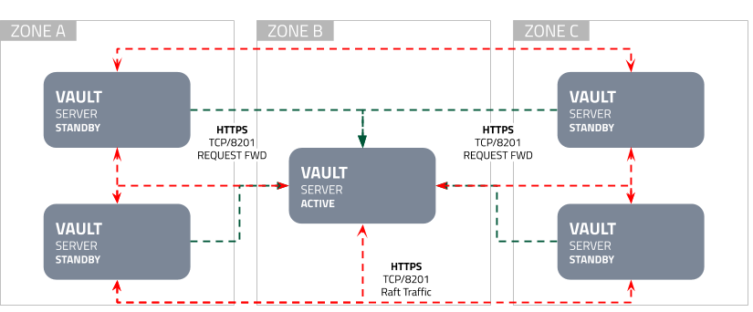
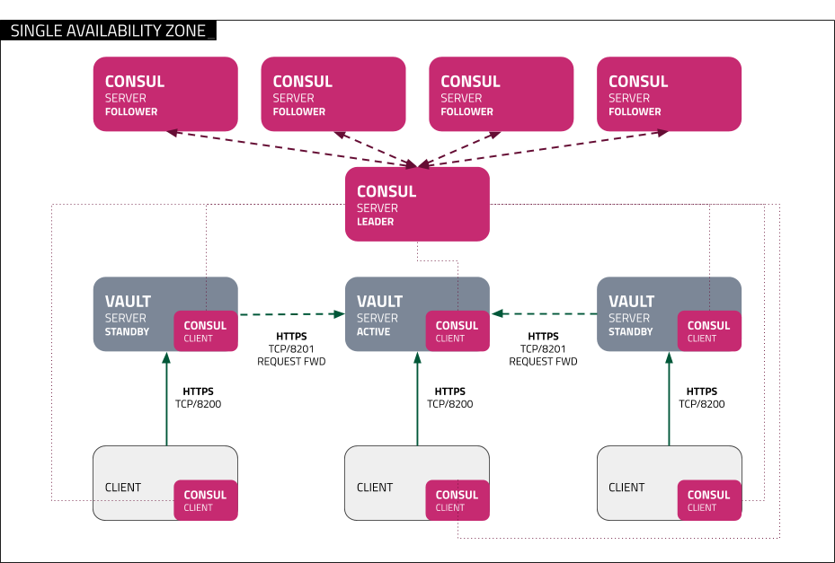

- [What](#what)
  - [Features:](#features)
- [Why](#why)
- [How](#how)
  - [Infrastructure](#infrastructure)
    - [Docker-compose](#docker-compose)
      - [Integrated Storage](#integrated-storage)
        - [Regions](#regions)
        - [Zones](#zones)
          - [Region A](#region-a)
          - [Region B](#region-b)
          - [Region C](#region-c)
      - [Consul](#consul)
        - [Regions](#regions-1)
        - [Zones](#zones-1)
  - [Requirements](#requirements)
  - [Networks](#networks)
    - [Communication between Regions](#communication-between-regions)
  - [Initial configuration](#initial-configuration)
    - [Install yapi](#install-yapi)
  - [Docker Infrastructure](#docker-infrastructure)
    - [Primary Cluster](#primary-cluster)
    - [Secondary Cluster](#secondary-cluster)
    - [DR Cluster](#dr-cluster)
  - [Docker Operations](#docker-operations)
    - [Integrated Storage](#integrated-storage-1)
    - [Docker Consul](#docker-consul)
  - [Replication](#replication)
    - [Start the Proxy between clusters](#start-the-proxy-between-clusters)
    - [Configure Performance Replication](#configure-performance-replication)
    - [Check that replication is up](#check-that-replication-is-up)
  - [Commands supported](#commands-supported)
  - [Exposed ports: local -> container](#exposed-ports-local---container)
    - [Raft Primary](#raft-primary)
    - [Raft Secondary](#raft-secondary)
    - [Proxy](#proxy)
- [TODO](#todo)
- [Done](#done)
# What

A system to facilitate the creation of multiple Vault clusters.
Automating the setup of different types of Replication between them as close as possible to the [Vault reference architecture]( https://learn.hashicorp.com/vault/operations/ops-reference-architecture
)
## Features:
* Infrastructure 
  * Docker: via docker-compose templates
  * Kubernetes: via helm charts
    * Local (kind, k3s)
    * Cloud (GCP,EKS)
  * VMs: via terraform
* Storages
  * Consul
  * Raft
* Operations
  * Initialization
  * Unsealing
  * Replication setup
* Monitoring
  * Prometheus
  * Grafana

# Why 
To be able to easily setup and test different configuration and features of a full fledge Vault and Consul cluster setup.
# How 
## Infrastructure
### Docker-compose
#### Integrated Storage
##### Regions

Using the 3 Region setup architecture:


  
They can only communicate between regions using a `proxy` (sometimes incorrectly called Load Balancer) in this case `HAProxy`.
- Region 1 contains the `Primary` Vault cluster, configured following the [Deployment Guide](https://learn.hashicorp.com/vault/day-one/ops-deployment-guide)  
- Region 2 contains the `Secondary` Vault cluster, configured as [Performance Replication](https://learn.hashicorp.com/vault/operations/ops-replication)
- Region 3 will contain a `DR` Vault cluster configured as [Disaster Recovery](https://learn.hashicorp.com/vault/operations/ops-disaster-recovery)
  
##### Zones 

Each `Region` is composed of 3  networks (zones A,B,C) and has a set of Vault nodes.



###### Region A
* vault_primaryA
* vault_primaryB
* vault_primaryC
  
###### Region B
* vault_secondaryA
* vault_secondaryB
* vault_secondaryC
###### Region C
* vault_drA
* vault_drB
* vault_drC
  
#### Consul
##### Regions
The regions are the same as in Integrated Storage but only one network per Zone.

* vault_primary
* vault_secondary
* vault_dr
  
##### Zones



## Requirements 
* Docker 
* Docker-compose:
  *  Scheduling of containers
  *  Overlaying of configuration to avoid duplication
* [Yapi-ci](https://github.com/bruj0/yapi)
  * Initialization
  * API management
* Access to Premium or Pro version of Vault
* `vault` and `jq` binaries installed in the $PATH
      
To talk to Vault we will use `Yapi-ci`, this is a yaml file where we define how the API call will look like.

## Networks

### Communication between Regions

It uses an HAProxy instance in TCP mode by accessing the IP trough consul SRV DNS record but this can be changed to any type of service discovery supported by HAProxy.

(The Load Balancer in this diagram)


## Initial configuration
### Install yapi

```bash
$ pip install -U yapi-ci
$ yapi --version
0.1.6
```
## Docker Infrastructure 
- Set Storage to use
```bash
$ export STORAGE=raft
```
- Create the docker networks
```bash
$ infra/docker/networks.sh
```
### Primary Cluster
```bash
$ infra/docker/p up
```
### Secondary Cluster
```bash
$ infra/docker/s up
```
### DR Cluster
```bash
$ infra/docker/dr up
```

## Docker Operations
### Integrated Storage
* Init unsealer
```bash
$ ops/p init_unsealer
```
* Unseal unsealer and wait 3 seconds
```bash
$ ops/p unseal_unsealer
$ sleep 3
```
* Configure unsealer Vault instance
```bash
$ ops/p config_unsealer
```
* Restart Vault nodes
```bash
$ infra/docker/p restart
```
* Init vault01
```bash
$ ops/p init_recovery
```
* Check status of Node 01
```bash
$ ops/p 1 status
```
* Join nodes 01 and 02
```bash
$ ops/p 2 operator raft join http://primary_vault01_1:820
Using storage: raft
VAULT_ADDR=http://127.0.0.1:9302
Key       Value
---       -----
Joined    true
$ ops/p 3 operator raft join http://primary_vault01_1:8200
Using storage: raft
VAULT_ADDR=http://127.0.0.1:9303
Key       Value
---       -----
Joined    true

```
* Check raft status
```bash
$ ops/p 1 operator raft list-peers
Node       Address                   State       Voter
----       -------                   -----       -----
vault01    primary_vault01_1:8201    leader      true
vault02    primary_vault02_1:8201    follower    true
vault03    primary_vault03_1:8201    follower    true
```
### Docker Consul
TODO
## Replication
### Start the Proxy between clusters
```bash
$ infra/docker/networks proxy
```
### Configure Performance Replication
```bash
$ ops/p enable_perf
$ ops/s activate_perf
```

### Check that replication is up
Primary cluster:

```bash
ops/p 1 read sys/replication/performance/status
Key                     Value
---                     -----
cluster_id              b5b5fa27-f5b9-6521-1213-a0987277e63a
known_secondaries       [secondary]
last_performance_wal    62
last_reindex_epoch      0
last_wal                77
merkle_root             cb7fc463786620d4dad8f9695027e786af3f570f
mode                    primary
primary_cluster_addr    https://172.28.0.6:8201
state                   running
```

Secondary cluster:
```bash
ops/s 1 read sys/replication/performance/status
Key                            Value
---                            -----
cluster_id                     b5b5fa27-f5b9-6521-1213-a0987277e63a
connection_state               ready
known_primary_cluster_addrs    [https://primary_vault01_1:8201 https://primary_vault03_1:8201 https://primary_vault02_1:8201]
last_reindex_epoch             1586785390
last_remote_wal                0
merkle_root                    cb7fc463786620d4dad8f9695027e786af3f570f
mode                           secondary
primary_cluster_addr           https://172.28.0.6:8201
secondary_id                   secondary
state                          stream-wals
```

## Commands supported

```bash
$ ops/p help
Using storage: raft
Usage: ops/p <vault node> <vault command>| <operation command>
Raft:
  init_unsealer
  unseal_unsealer
  config_unsealer
  init_recovery
  <vault node> raft_config
Consul:
  init
  unseal
Replication:
    enable_perf
    activate_perf(only on secondary)
General:
  wipe
  vars: show Vault env vars
  vars_unsealer: show Vault env vars for the unsealer
  yapi: runs yapi with correct variables
  logs <node number>
  generate_root_recovery
```  

## Exposed ports: local -> container
### Raft Primary
Vault01:
- 9301 -> 8200 (API and UI)
- 9401 -> 8201 (Cluster Port)
Vault02:
- 9302 -> 8200 (API and UI)
- 9402 -> 8201 (Cluster Port)

Vault03:
- 9303 -> 8200 (Vault03 API and UI)
- 9403 -> 8201 (Cluster Port)
### Raft Secondary
Vault01:
- 9501 -> 8200 (API and UI)
- 9601 -> 8201 (Cluster Port)
Vault02:
- 9402 -> 8200 (API and UI)
- 9602 -> 8201 (Cluster Port)

Vault03:
- 9403 -> 8200 (Vault03 API and UI)
- 9603 -> 8201 (Cluster Port)

### Proxy
- 8819 -> 1936 (HAProxy stats)
- 8801 -> 8200 ( Primary cluster, Active Vault node API )
- 8901 -> 8200 ( Secondary cluster, Active Vault node API)


# TODO
- [ ] Docker image build documentation
- [ ] Configure Monitoring
- [ ] Generate PKI certificates and use them
- [ ] Configure DR cluster

# Done
- [X] HSM auto unsealing
- [X] Add Vault container for PKI
- [x] Initialization and Unsealing with `yapi`
- [X] Configure primary as Performance replication
- [X] Create replacement for Tavern
- [X] Better startup handling
